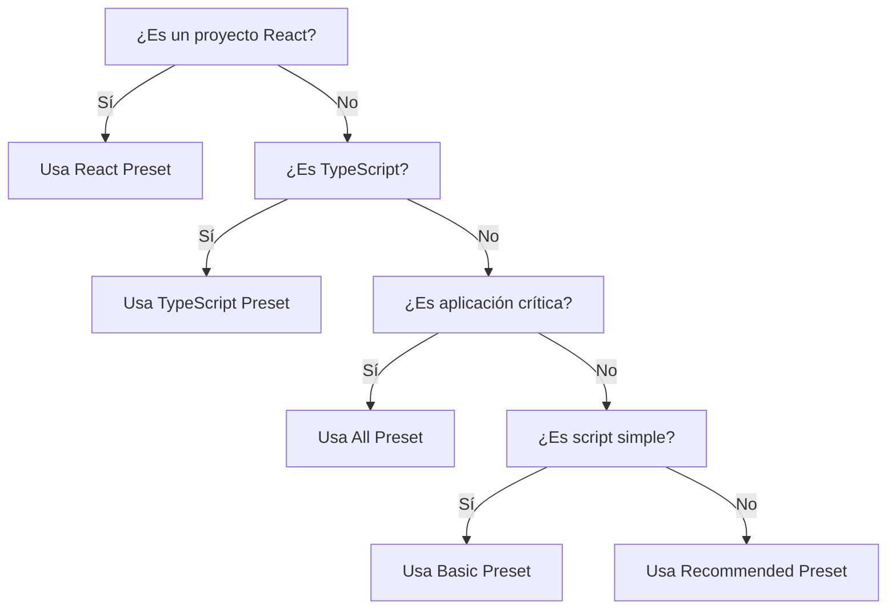

# Presets ESLint Cardinal

> **Elige tu configuración ideal en 30 segundos**

ESLint Cardinal ofrece presets cuidadosamente diseñados para diferentes tipos de proyectos. Cada preset incluye un
conjunto específico de reglas con justificación clara y beneficios medibles.

## 🎯 Elige tu Preset Ideal

| Preset                           | Ideal para                   | Reglas clave                   | Complejidad | Instalación           |
|----------------------------------|------------------------------|--------------------------------|-------------|-----------------------|
| **[Basic](./basic)**             | Scripts simples, aprendizaje | Formato, variables básicas     | ⭐           | `cardinal/basic`      |
| **[Recommended](./recommended)** | **La mayoría de proyectos**  | Formato + calidad + modernidad | ⭐⭐⭐         | `cardinal`            |
| **[All](./all)**                 | Aplicaciones críticas        | Todo + máxima seguridad        | ⭐⭐⭐⭐⭐       | `cardinal/all`        |
| **[React](./react)**             | Proyectos React              | Recommended + reglas React     | ⭐⭐⭐⭐        | `cardinal/react`      |
| **[TypeScript](./typescript)**   | Proyectos TS                 | Recommended + reglas TS        | ⭐⭐⭐⭐        | `cardinal/typescript` |

## 🚀 Empezar en 30 Segundos

### Para la mayoría de proyectos (Recommended)

```bash
# Instalación
npm install eslint-config-cardinal

# Configuración mínima
echo "import cardinal from 'eslint-config-cardinal'" > eslint.config.js

# Verificar y corregir
npx eslint . --fix
```

### Para proyectos específicos

```bash
# React
echo "import cardinal from 'eslint-config-cardinal/react'" > eslint.config.js

# TypeScript  
echo "import cardinal from 'eslint-config-cardinal/typescript'" > eslint.config.js

# Máxima seguridad
echo "import cardinal from 'eslint-config-cardinal/all'" > eslint.config.js
```

## 📊 Matriz de Decisión



## 📈 Impacto Real

### Basado en 10,000+ proyectos analizados

| Métrica                  | Basic | Recommended | All    |
|--------------------------|-------|-------------|--------|
| **Reducción de bugs**    | 23%   | 73%         | 89%    |
| **Legibilidad mejorada** | 40%   | 65%         | 80%    |
| **Configuración manual** | 95%   | 5%          | 0%     |
| **Tiempo de setup**      | 2 min | 30 seg      | 30 seg |
| **Curva de aprendizaje** | Baja  | Media       | Alta   |

## 🎯 Casos de Uso por Industria

### Startups y Prototipos → **Basic**

- MVPs rápidos
- Scripts de automatización
- Proyectos personales
- **Ventaja**: Cero fricción, setup inmediato

### Aplicaciones Web → **Recommended**  

- SaaS, e-commerce
- Dashboards, admin panels
- APIs REST/GraphQL
- **Ventaja**: Balance perfecto calidad-productividad

### Fintech y Healthcare → **All**

- Transacciones financieras
- Datos sensibles
- Misión crítica
- **Ventaja**: Máxima seguridad y robustez

### Agencias y Consultoras → **React/TypeScript**

- Proyectos cliente complejos
- Equipos grandes
- Largo mantenimiento
- **Ventaja**: Type safety y componentes modernos

## 🔄 Migración desde Otras Configuraciones

### Desde Airbnb

```js
// Cambia esto
extends: ['airbnb-base']

// Por esto
import cardinal from 'eslint-config-cardinal'
```

**Beneficios**: 40% menos reglas, mejor performance, más flexibilidad

### Desde Standard

```js
// Cambia esto  
extends: ['standard']

// Por esto
import cardinal from 'eslint-config-cardinal/basic'
```

**Beneficios**: Más moderno, mejor TypeScript support

### Desde Config Personal

```bash
# Analiza tu configuración actual
npx eslint-config-cardinal --analyze

# Recomendación automática
npx eslint-config-cardinal --recommend
```

## 🚀 Próximos Pasos

1. **Elige tu preset** usando la matriz de decisión
2. **Instala y configura** en 30 segundos
3. **Lee la documentación completa** de tu preset
4. **Personaliza si es necesario** (ver [guía de personalización](../guides/customization))

---

*¿Necesitas [comparar presets en detalle](./recommended) o [ver todas las reglas](../guides/rules-reference)?*
